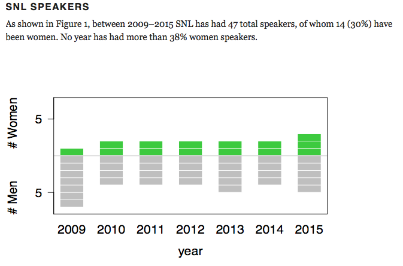

## Why? 

Gender imbalances are real!

## Exhibit 1

Speakers (keynote, debates, invited symposium) at the Society for the Neurobiology of Language conferences 2009–2015

[Source](https://thewinnower.com/papers/3415-speaker-gender-balance-at-society-for-the-neurobiology-of-language-conferences-2009-2015)

## Exhibit 1 cont.

It's not because there are not enough experts

[Source](https://thewinnower.com/papers/3415-speaker-gender-balance-at-society-for-the-neurobiology-of-language-conferences-2009-2015)

## Exhibit 2

53 Phonology conferences, analyzed between 1993 and 2013

49% selected, 37% invited talks

[Source](http://blogs.umass.edu/phonolist/2016/01/05/the-representation-of-women-in-phonological-discussion/)

## Exhibit 3

And, because it's Nobel Prize week...

[Source](https://www.statista.com/chart/2805/nobel-prize-winners-by-gender/)

## Exhibit 4: Our own experiences 

[Source](https://twitter.com/jengolbeck/status/783287116524642304)

## Exhibit 4: Our own experiences 

(See also CogTales!)

## Why?

It's not just academia!

## Exhibit 4

[Source](http://fivethirtyeight.com/live-blog/first-presidential-debate-election-2016/)

## Exhibit 5

[Source](ttp://motherboard.vice.com/read/female-investors-female-startups-crunchbase-data)

[See also](https://si.wsj.net/public/resources/images/SM-AA934_WOMENs_G_20140818161509.jpg)

## Does R-Ladies help?

Digital fluency helps close the gender wage gap!

[Source](http://fortune.com/2016/03/03/women-digitally-fluent/?iid=sr-link1)

## Does R-Ladies help?

How's digital fluency in France and across the globe?

[Source](http://fortune.com/2016/03/03/women-digitally-fluent/?iid=sr-link1)

## What are we actually doing?

A regular (monthly) meeting, centered around R

Topics will include: 

- Introduction to R
- Mentoring (matching up experienced users and beginners, people new to industry and senior folks)
- Discussion of specific packages and tools (such as tidyverse, shiny, ggplot2, RMarkdown)
- Tutorials (e.g., on visualization principles and techniques, data wrangling, analysis techniques)

## Who

Organized by Page Piccinini (NPI), Christina Bergmann (LSCP), and Diane Beldame (ThinkR)

Currently about 60 members

You are invited, too, independent of your gender identity. Really! Men can come, as long as a member who is also there vouches for them. 

## How

Join the meetup.com group and RSVP to the meetings that interest you. 

Note, there is a code of conduct. Yes, it's necessary. 

## Sponsors

>- DEC
>- CogWorks
>- ThinkR
- ...

